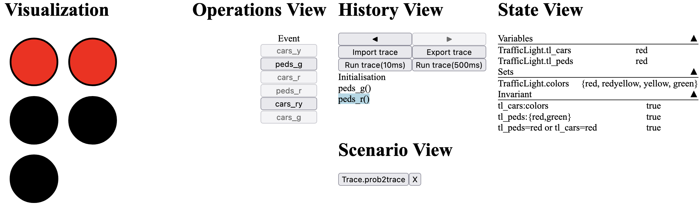

# B2Program

This is the code generator **B2Program** for generating code from B to other
programming languages (Java, C++, Python, JavaScript/TypeScript).
Currently, code generation for Prolog and Rust are in progress.
The work for Clojure and C has begun but not continued.


Paper: https://www.researchgate.net/publication/337441241_A_Multi-target_Code_Generator_for_High-Level_B

Citation:

```
@InProceedings{b2program,
author = {Vu, Fabian and Hansen, Dominik and K{\"{o}}rner, Philipp and Leuschel, Michael},
year = {2019},
month = {11},
pages = {456-473},
Booktitle = {Proceedings {iFM} 2019},
title = {A Multi-target Code Generator for High-Level B},
isbn = {978-3-030-34967-7},
doi = {10.1007/978-3-030-34968-4_25}
}
```

The main features of B2Program are:
- Code generation from a formal model
- Code generation for model checking including parallelization, and caching (only supported in Java and C++)
- Code generation of interactive domain-specific visualizations (from VisB) in HTML and JavaScript/TypeScript


Note:

* The implementation of the B types in C++ uses persistent set from:
  https://github.com/arximboldi/immer
* The library must first be installed before the generated C++ code can be used.
* The generated code for C works for a subset of the generated code that works
  for Java and C++.
* Sets and couples are not supported for C.
  Including other machines is not supported in C, too.
  The only types that are implemented for C are BInteger and BBoolean.
  An example where code generation for C works is the machine Lift.
* Executing all tests requires building Java B Types and installing C++ B Types


## Performance

Performance Evaluation for Execution described in [benchmarks/execution/README.md](benchmarks/execution/README.md).

Performance Evaluation for Model Checking described in [benchmarks/model_checking/README.md](benchmarks/model_checking/README.md).

## Build Java B Types

Primitive Integer: `make btypes_primitives`

Big Integer: `make btypes_big_integer`


## Install C++ B Types
```bash
mkdir build && cd build
cmake ..
make install
```

Make sure that the immer library and gmpxx library (for big integers) are installed before.


## Supported Subset of B

### Machine sections:

| Machine Section    | Usage                                                                                                  |
|--------------------|--------------------------------------------------------------------------------------------------------|
| SETS               |                                            S (Deferred Set)                                            |
|                    |                                   T = {e1, e2, ...} (Enumerated Set)                                   |
| CONSTANTS          |                                                x,y, ...                                                |
| CONCRETE_CONSTANTS |                                               cx, cy, ...                                              |
| PROPERTIES         | c = v (where c is a constant and v is a value)                                                         |
|                    | card(S) = n (where S is a deferred set and n is a number)                                              |
|                    | S = {c1,...,cn} & card(S) = n  (where S is a deferred set, c1,..., cn are constants and n is a number) |
| VARIABLES          | x,y, ...                                                                                               |
| CONCRETE_VARIABLES | cx, cy, ...                                                                                            |
| INVARIANT          | P (Logical Predicate)                                                                                  |
| ASSERTIONS         | P1;...;P2 (List Of Logical Predicates)                                                                 |
| INITIALISATION     |                                                                                                        |
| OPERATIONS         |                                                                                                        |


Note that code is not generated from INVARIANT and ASSERTIONS. These constructs are used for verifying the machine only.
CONSTRAINTS and DEFINITIONS clause are not supported for code generation.


### Machine inclusion:

| Machine inclusion | Usage                        |
|-------------------|------------------------------|
| INCLUDES          | M1 ... MN (List of Machines) |
| EXTENDS           | M1 ... MN (List of Machines) |

Other machine inclusion clauses (SEES, USES, PROMOTES and REFINES) are not supported yet.


### Logical Predicates:

| Predicate             | Meaning                    |
|-----------------------|----------------------------|
| P & Q                 | conjunction                |
| P or Q                | disjunction                |
| P => Q                | implication                |
| P <=> Q               | equivalence                |
| not P                 | negation                   |
| !(x1,...,xn).(P => Q) | universal quantification   |
| #(x1,...,xn).(P & Q)  | existential quantification |

Restriction: As universal quantifications and existential quantifications are quantified constructs, the predicate P must constraint the value of the variables x1, ..., xn.
P is a conjunction of n conjuncts where the i-th conjunct must constraint xi for each i in {1,...,n}.

### Equality:

| Predicate             | Meaning    |
|-----------------------|------------|
| E = F                 | equality   |
| E \= F                | inequality |

### Booleans:

| Boolean | Meaning                             |
|---------|-------------------------------------|
| TRUE    | true value                          |
| FALSE   | false value                         |
| BOOL    | set of boolean values {TRUE, FALSE} |
| bool(P) | convert predicate into BOOL value   |


### Sets:

| Set expression or predicate  | Meaining                                   |
|------------------------------|--------------------------------------------|
| {}                           | Empty Set                                  |
| {E}                          | Singleton Set                              |
| {E,F,...}                    | Set Enumeration                            |
| {x1,...,xn\|P}               | Set Comprehension                          |
| POW(S)                       | Power Set                                  |
| POW1(S)                      | Set of Non-Empty Subsets                   |
| FIN(S)                       | Set of All Finite Subsets                  |
| FIN1(S)                      | Set of All Non-Empty Finite Subsets        |
| card(S)                      | Cardinality                                |
| S * T                        | Cartesian Product                          |
| S \/ T                       | Set Union                                  |
| S /\ T                       | Set Intersection                           |
| S - T                        | Set Difference                             |
| E : S                        | Element of                                 |
| E /: S                       | Not Element of                             |
| S <: T                       | Subset of                                  |
| S /<: T                      | Not Subset of                              |
| S <<: T                      | Strict Subset of                           |
| S /<<: T                     | Not Strict Subset of                       |
| union(S)                     | Generalized Union over Sets of Sets        |
| inter(S)                     | Generalized Intersection over Sets of Sets |
| UNION(z1,...,zn).(P\|E)      | Generalized Union with Predicate           |
| INTER(z1,...,zn).(P\|E)      | Generalized Intersection with Predicate    |

Restriction: Set comprehesions, generalized unions and generalized intersections are quantified constructs. The predicate P must be a conjunction where the first n conjuncts must constraint the bounded variables.
The i-th conjunct must constraint xi for each i in {1,...,n}.


### Numbers:

| Number expression or predicate | Meaning                                       |
|--------------------------------|-----------------------------------------------|
| INTEGER                        | Set of Integers                               |
| NATURAL                        | Set of Natural Numbers                        |
| NATURAL1                       | Set of Non-Zero Natural Numbers               |
| INT                            | Set of Implementable Integers                 |
| NAT                            | Set of Implementable Natural Numbers          |
| NAT1                           | Set of Non-Zero Implementable Natural Numbers |
| n..m                           | Set of Numbers from n to m                    |
| MININT                         | Minimum Implementable Integer                 |
| MAXINT                         | Maximum Implementable Integer                 |
| m > n                          | Greater Than                                  |
| m < n                          | Less Than                                     |
| m >= n                         | Greater Than or Equal                         |
| m <= n                         | Less Than Or Equal                            |
| max(S)                         | Maximum of a Set of Numbers                   |
| min(S)                         | Minimum of a Set of Numbers                   |
| m + n                          | Addition                                      |
| m - n                          | Difference                                    |
| m * n                          | Multiplication                                |
| m / n                          | Division                                      |
| m ** n                         | Power                                         |
| m mod n                        | Remainder of Division                         |
| PI(z1,...,zn).(P\|E)           | Set product                                   |
| SIGMA(z1,...,zn).(P\|E)        | Set summation                                 |
| succ(n)                        | Successor                                     |
| pred(n)                        | Predecessor                                   |

Restrictions:

INTEGER, NATURAL and NATURAL1 are infinite sets. They are only supported on the right-hand side of a set predicate.

Set product and set summation are quantified constructs. The predicate P must be a conjunction where the first n conjuncts must constraint the bounded variables.
The i-th conjunct must constraint xi for each i in {1,...,n}.

### Relations:

| Relation expression | Meaining                                              |
|---------------------|-------------------------------------------------------|
| S <-> T             | Set of relation                                       |
| E \|-> F            | Couple                                                |
| dom(r)              | Domain of Relation                                    |
| range(r)            | Range of Relation                                     |
| id(S)               | Identity Relation                                     |
| S <\| r             | Domain Restriction                                    |
| S <<\| r            | Domain Substraction                                   |
| r \|> S             | Range Restriction                                     |
| r \|>> S            | Range Substraction                                    |
| r~                  | Inverse of Relation                                   |
| r[S]                | Relational Image                                      |
| r1 <+ r2            | Relational Overriding                                 |
| r1 >< r2            | Direct Product                                        |
| (r1 ; r2)           | Relational Composition                                |
| (r1 \|\| r2)        | Parallel Product                                      |
| prj1(S,T)           | Projection Function                                   |
| prj2(S,T)           | Projection Function                                   |
| closure1(r)         | Transitive Closure                                    |
| closure(r)          | Transitive Reflxibe Closure                           |
| iterate(r,n)        | Iteration of r with n                                 |
| fnc(r)              | Translate Relation A <-> B into function A +-> POW(B) |
| rel(r)              | Translate Relation A <-> POW(B) into relation A <-> B |

Restriction: Set of Relation mostly grows up very fast. They are only supported on the right-hand side of a set predicate.

### Functions:

| Function Expression | Meaning                           |
|---------------------|-----------------------------------|
| S +-> T             | Partial Function                  |
| S --> T             | Total Function                    |
| S +->> T            | Partial Surjection                |
| S -->> T            | Total Surjection                  |
| S >+> T             | Partial Injection                 |
| S >+>> T            | Partial Bijection                 |
| S >->> T            | Total Bijection                   |
| %(x1,...,xn).(P\|E) | Lambda Abstraction                |
| f(E)                | Function Application              |
| f(E1,...,EN)        | Function Application with Couples |

Restriction: Lambda expressions are quantified constructs. The predicate P must be a conjunction where the first n conjuncts must constraint the bounded variables.
The i-th conjunct must constraint xi for each i in {1,...,n}.

### Sequences:

| Sequence Expression | Meaning                                |
|---------------------|----------------------------------------|
| <> or []            | Empty Sequence                         |
| [E]                 | Singleton Sequence                     |
| [E1,...,EN]         | Sequence with N elements               |
| size(S)             | Size of Sequence                       |
| s^t                 | Concatenation                          |
| E -> s              | Prepend element                        |
| s <- E              | Append element                         |
| rev(S)              | Reverse of Sequence                    |
| first(S)            | First Element                          |
| last(S)             | Last Element                           |
| front(S)            | Front of Sequence                      |
| tail(S)             | Tail of Sequence                       |
| conc(S)             | Concatenation of Sequence of Sequences |
| s /\|\ n            | Take first n elements of sequence      |
| s \\|/ n            | Drop first n elements of sequence      |

The following constructs are not supported for code generation: seq(S), seq1(S), iseq(S), iseq1(S) and perm(S).
They are only allowed in the predicate of constructs for verification such as invariant or precondition.

### Records:

| Record/Struct expression  | Meaning                                          |
|---------------------------|--------------------------------------------------|
| struct(ID1:T1,...,IDN:TN) | Set of Records with Given Fields and Field Types |
| rec(ID1:E1,...,IDN:EN)    | Record with Given Field Names and Values         |
| E'ID                      | Get value of field with name ID                  |

Nested record accesses are also supported.


### Strings:

| String Expression | Meaning            |
|-------------------|--------------------|
| "string"          | String Value       |
| STRING            | Set of All Strings |

Restriction: STRING is a infinite set. It is only supported on the right-hand side of a set predicate.


### LET and IF-THEN-ELSE Expression and Predicate:

| Expression or Predicate                           | Notes                                   |
|---------------------------------------------------|-----------------------------------------|
| IF P THEN E1 ELSE E2 END                          | E1 and E2 are expressions or predicates |
| LET x1,...,xn BE x1 = E1 & ... & xn = En IN E END | E is a predicate or a expression        |


### Substitution:

| Substitution                                      | Meaning                                                  |
|---------------------------------------------------|----------------------------------------------------------|
| skip                                              | No Operation                                             |
| x := E                                            | Assignment                                               |
| f(X) := E                                         | Functional Override                                      |
| f'ID := E                                         | Record Access                                            |
| x :: S                                            | Choice from Set                                          |
| x : (P)                                           | Choice by Predicate                                      |
| x <-- OP(X)                                       | Operation Call and Assignment of Return Value            |
| G \|\| H                                          | Parallel Substitution                                    |
| G ; H                                             | Sequential Substitution                                  |
| ANY x1,...,xn WHERE P THEN G END                  | Non Deterministic Choice                                 |
| LET x1,...,xn BE x1=E1 & ... & xn = En IN G END   | Let Substitution                                         |
| VAR x1,...,xn IN G END                            | Generate local variables                                 |
| PRE P THEN G END                                  | Substitution with Precondition                           |
| ASSERT P THEN G END                               | Substitution with Assertion                              |
| CHOICE G or H END                                 | Choice Substitution                                      |
| IF P THEN G END                                   | IF Substitution                                          |
| IF P THEN G ELSE H                                | IF-THEN-ELSE Substitution                                |
| IF P1 THEN G1 ELSIF P2 THEN G2 ... ELSE Gn END    | IF-THEN-ELSE Substitution with Many Else Branches        |
| SELECT P THEN G END                               | SELECT Substitution                                      |
| CASE E OF EITHER m THEN G or n THEN H ... END END | CASE substitution                                        |

Functional Override and Record Access with assignment can be nested.

Preconditions and Assertions are constructs that are relevant for verification. They are ignored at code generation.

Assignments, Operation Calls, Choice from Set and Choice By Predicate can contain many variables on the left-hand side.
Furthermore Choice By Predicate can use previous values of variables.

Restriction: Choice by Predicates are quantified constructs. The predicate P must be a conjunction where the first n conjuncts must constraint the bounded variables.
The i-th conjunct must constraint xi for each i in {1,...,n}.

Comments are ignored during code generation. Furthermore trees and pragmas are not supported by B2Program.


Remarks: 
* SELECT with ELSE Branches are not supported yet
* Non-determinism for model checking is only supported for top-level SELECT and PRE


## Usage

### Starting the code generator

#### Gradle

```bash
# Java
./gradlew run -Planguage="java" [-Pbig_integer="true/false" -Pminint="minint" -Pmaxint="maxint" -Pdeferred_set_size="size" -PuseConstraintSolving="true/false" -PforModelchecking="true/false"] -Pfile="<path_relative_to_project_directory>"

# C++
./gradlew run -Planguage="cpp" [-Pbig_integer="true/false" -Pminint="minint" -Pmaxint="maxint" -Pdeferred_set_size="size" -PuseConstraintSolving="true/false" -PforModelchecking="true/false"] -Pfile="<path_relative_to_project_directory>"

# Python
./gradlew run -Planguage="python" [-Pbig_integer="true/false" -Pminint="minint" -Pmaxint="maxint" -Pdeferred_set_size="size" -PuseConstraintSolving="true/false" -PforModelchecking="true/false"] -Pfile="<path_relative_to_project_directory>"

# JavaScript/TypeScript
./gradlew run -Planguage="ts" [-Pbig_integer="true/false" -Pminint="minint" -Pmaxint="maxint" -Pdeferred_set_size="size" -PuseConstraintSolving="true/false" -PforModelchecking="true/false"] -Pfile="<path_relative_to_project_directory>"

# C
./gradlew run -Planguage="c" [-Pbig_integer="true/false" -Pminint="minint" -Pmaxint="maxint" -Pdeferred_set_size="size" -PuseConstraintSolving="true/false" -PforModelchecking="true/false"] -Pfile="<path_relative_to_project_directory>"

Default Values:
big_integer: false
minint: -2147483648
maxint: 2147483647
deferred_set_size: 10
useConstraintSolving: false
forModelchecking: false
```

`-PuseConstraintSolving` is in an experimental stage.

#### JAR-File

1. Run `./gradlew fatJar` to build the JAR-file
2. Generate code from the machine

```bash
java -jar B2Program-all-0.1.0-SNAPSHOT.jar -l {java|cpp|python|typescript|c} [-bi <isBigInteger>] [-min <minint>] [-max <maxint>] [-dss <deferred_set_size>] [-cs <use_constraint_solving>] [-mc <for_model_checking>] [-v <visualisation] -f <file_path_relative_to_jar_file>
```

Remark: Visualisation is the path to a VisB file. It is only available for TypeScript/JavaScript

### Compile generated Code

#### Java

1. Build JAR for Java B Types (`make btypes_primitives` or `make btypes_big_integer`)
2. Move `btypes_persistent.jar` to same directory as the generated classes
3. `javac -cp btypes_primitives-all.jar <files....>`
4. Example: `javac -cp btypes_primitives-all.jar TrafficLightExec.java TrafficLight.java`
  (Code generated from TrafficLightExec.mch which includes TrafficLight.mch)
  
#### C++
  
1. Install C++ B Types or move them (see btypes_primitives or btypes_big_integer directory) to same directory as the generated classes
2. `g++ -std=c++14 -O2 -march=native -g -DIMMER_NO_THREAD_SAFETY -o <executable> <main class>`
3. Example: `g++ -std=c++14 -O2 -flto -march=native -g -DIMMER_NO_THREAD_SAFETY -o TrafficLightExec.exec TrafficLightExec.cpp`
   (TrafficLightExec.mch includes TrafficLight.mch, this command automatically compiles TrafficLight.cpp)

#### JavaScript/TypeScript
1. Move B types to same folder (see btypes_primitives or btypes_big_integer directory) as generated code
2. Move immutable library to same folder as generated code
3. `tsc --target ES6 --moduleResolution node <files...>`
4. Example: `tsc --target ES6 --moduleResolution node TrafficLightExec.ts TrafficLight.ts`
   (Code generated from TrafficLightExec.mch which includes TrafficLight.mch)


### Execute generated code (manual simulation)

#### Java

1. Write a main function in the generated main class
2. `java -cp :btypes_primitives-all.jar <main file>`
3. Example: `java -cp :btypes_primitives-all.jar TrafficLightExec`

#### C++

1. Write a main function in the generated main class
2. `./<main file>`
3. Example: `./TrafficLightExec.exec`

#### JavaScript/TypeScript
1. Write a main function in the generated main class
2. `node --experimental-specifier-resolution=node <main file>`
3. Example: `node --experimental-specifier-resolution=node TrafficLightExec.js`


### Execute generated model checking code

#### Java

1. `java -cp :btypes_primitives-all.jar <main file> <strategy> <threads> <caching>`
2. Example: `java -cp :btypes_primitives-all.jar TrafficLight mixed 6 true`

#### C++

1. `./<main file> <strategy> <threads> <caching>`
2. Example: `./TrafficLight.exec mixed 6 true`


Remark: 
* strategy : {mixed, bf, df}
* threads : NATURAL
* caching : {TRUE, FALSE}


Currently, there is also a Makefile which automizes these steps.
Therefore, the B model must be in the top-level directory of this project, and execute these steps:
```
make b2program
make btypes_primitives (or make btypes_big_integer)
make <file> LANGUAGE = <language>
```

Example:
```
make b2program
make btypes_primitives
make CAN_BUS_tlc LANGUAGE = java
```


### Execute generated interactive validation document

By specifying a visualization, B2Program also supports generating an interactive (HTML) validation document, i.e.,
an interactive domain-specific visualization from VisB.
Here, the specified language must be JavaScript/TypeScript.
An example of such an interactive validation document is shown below.



The interactive domain-specific validation document consists of the VisB View, the Operations View, the History View, the Scenario View, and the State View.
The VisB View contains the domain-specific visualization as an SVG image.
Here, it is possible for a domain expert to execute events (by clicking on the graphical elements), and to inspect the model's state.
The Operations View shows operations that are enabled in the model's current state.
It makes it possible for a domain expert to animate the model.
Furthermore, it shows enabled events, and parameters for which an event is enabled.
Within the history view, a domain expert can inspect the currently animated trace, or run the trace with delay (10ms and 500ms).
Here, it is also possible to step within the trace, and to import/export the trace, targeting other validation documents or ProB2-UI.
Imported trace will be shown in the Scenario View.
The right-hand side shows the State View consisting of the variables', constants', sets', and invariants' values in mathematical B notation.


#### Steps to Interactive Validation Document (Example: Traffic Light)

1. Run `./gradlew fatJar` to build the JAR-file
2. Move the built JAR-file `B2Program-all-0.1.0-SNAPSHOT` to the same folder as `TrafficLight.mch` and VisB files (`TrafficLight.json` as VisB Glue File, and `TrafficLight.svg` as SVG image)
3. Generate code for `TrafficLight.mch` and `TrafficLight.json` ```java -jar B2Program-all-0.1.0-SNAPSHOT.jar -l ts -f TrafficLight.mch -v TrafficLight.json```
4. Move B types to same folder (see btypes_primitives or btypes_big_integer directory) as generated code
5. Move immutable library to same folder as generated code
6. Compile generated TypeScript files `tsc --target ES6 --moduleResolution node TrafficLight.ts`
7. Open Interactive Validation Document for TrafficLight (`TrafficLight.html`)


## Steps from B Model to Execution of the Generated Code (with primitive types)

### Example 1: Lift

The file for `Lift.mch` is in https://github.com/favu100/b2program/tree/master/src/test/resources/de/hhu/stups/codegenerator.
Lift consists of operation to lift up and lift down and getting the floor.

#### Execution with manual simulation

##### Java

* Run `./gradlew fatJar` to build the JAR-file
* Move the built JAR-file `B2Program-all-0.1.0-SNAPSHOT` to the same folder as `Lift.mch`
* Generate code for `Lift.mch` with ```java -jar B2Program-all-0.1.0-SNAPSHOT.jar -l java -f Lift.mch ```
* Write a main method in `Lift.java` 
```java
public static void main(String[] args) {
    Lift lift = new Lift();
    lift.inc();
    lift.inc();
    lift.inc();
    System.out.println(lift.getFloor());
}
```

* Build B types in btypes_primitives `./gradlew fatJar` in the belonging directory or execute `make` which builds btypes_primitives and move it to this folder
* Move `btypes_primitives-all.jar` to the same directory as `Lift.java`
* Compile `Lift.java` with `javac -cp btypes_primitives-all.jar Lift.java`
* Execute the compiled file for `Lift.java` with `java -cp :btypes_primitives-all.jar Lift`
* Output: `3`

##### C++
* Run `./gradlew fatJar` to build the JAR-file
* Move the built JAR-file `B2Program-all-0.1.0-SNAPSHOT` to the same directory as `Lift.mch`
* Generate code for `Lift.mch` ```java -jar B2Program-all-0.1.0-SNAPSHOT.jar -l -cpp -f Lift.mch ```
* Write a main method in `Lift.cpp` 
```cpp
int main() {
    Lift lift;
    lift.inc();
    lift.inc();
    lift.inc();
    cout << lift.getFloor() << "\n";;
    return 0;
}
```

* Install C++ B types with
```bash
mkdir build & cd build
cmake ..
make install
```

* Compile `Lift.cpp` with `g++ -std=c++14 -O2 -flto -march=native -g -DIMMER_NO_THREAD_SAFETY -o Lift.exec Lift.cpp`
* Execute `Lift.exec` with `./Lift`

##### JavaScript/TypeScript

* Run `./gradlew fatJar` to build the JAR-file
* Move the built JAR-file `B2Program-all-0.1.0-SNAPSHOT` to the same directory as `Lift.mch`
* Generate code for `Lift.mch` with ```java -jar B2Program-all-0.1.0-SNAPSHOT.jar -l ts -f Lift.mch ```
* Write additional code executing generated functions in `Lift.ts`

```typescript
let lift: Lift = new Lift();
lift.inc();
lift.inc();
lift.inc();
console.log(lift.getFloor().toString());
```

* Move `btypes_primitives` for `js` to the same directory as `Lift.ts`
* Transpile `Lift.ts` to `Lift.js` with `tsc --target ES6 --moduleResolution node Lift.ts`
* Execute the transpiled file with `node --experimental-specifier-resolution=node Lift.js`
* Output: `3`

#### Model Checking

##### Java

* Run `./gradlew fatJar` to build the JAR-file
* Move the built JAR-file `B2Program-all-0.1.0-SNAPSHOT` to the same folder as `Lift.mch`
* Generate code for `Lift.mch` with ```java -jar B2Program-all-0.1.0-SNAPSHOT.jar -l java -f Lift.mch -mc true```
* Build B types in btypes_primitives `./gradlew fatJar` in the belonging folder or execute `make`which builds btypes_primitives and move it to this folder
* Move `btypes_primitives-all.jar` to the same folder as `Lift.java`
* Compile `Lift.java` with `javac -cp btypes_primitives-all.jar Lift.java`
* Execute the compiled file for `Lift.java` with `java -cp :btypes_primitives-all.jar Lift mixed 1 false`


##### C++
* Run `./gradlew fatJar` to build the JAR-file
* Move the built JAR-file `B2Program-all-0.1.0-SNAPSHOT` to the same folder as `Lift.mch`
* Generate code for `Lift.mch` ```java -jar B2Program-all-0.1.0-SNAPSHOT.jar -l cpp -f Lift.mch -mc true```
* Install C++ B types with
```bash
mkdir build & cd build
cmake ..
make install
```

* Compile `Lift.cpp` with `g++ -std=c++14 -O2 -flto -march=native -g -DIMMER_NO_THREAD_SAFETY -o Lift.exec Lift.cpp`
* Execute `Lift.exec` with `./Lift 1 false`


### Example 2: Cruise_finite1_deterministic_exec
The file for `Cruise_finite1_deterministic_exec.mch` and `Cruise_finite1_deterministic` are in https://github.com/favu100/b2program/tree/master/src/test/resources/de/hhu/stups/codegenerator.
The machine Cruise_finite1_deterministic_exec includes the machine Cruise_finite1_deterministic. 
Cruise_finite1_deterministic_exec contains an operation for executing a cycle in the state space of Cruise_finite1_deterministic 100.000 times.
Furthermore it has getter operations for all variables.

#### Execution with manual simulation

##### Java

* Run `./gradlew fatJar` to build the JAR-file
* Move the built JAR-file `B2Program-all-0.1.0-SNAPSHOT` to the same folder as `Cruise_finite1_deterministic_exec.mch` and `Cruise_finite1_deterministic.mch`
* Generate code for `Cruise_finite1_deterministic_exec.mch` ```java -jar B2Program-all-0.1.0-SNAPSHOT.jar -l java -f Cruise_finite1_deterministic.mch```
* Write a main method in `Cruise_finite1_deterministic_exec.java`
```java
public static void main(String[] args) {
    Cruise_finite1_deterministic_exec cruise = new Cruise_finite1_deterministic_exec();
    cruise.simulate();
    System.out.println(cruise.getCruiseAllowed());
    System.out.println(cruise.getCruiseActive());
    System.out.println(cruise.getVehicleAtCruiseSpeed());
    System.out.println(cruise.getVehicleCanKeepSpeed());
    System.out.println(cruise.getVehicleTryKeepSpeed());
    System.out.println(cruise.getSpeedAboveMax());
    System.out.println(cruise.getVehicleTryKeepTimeGap());
    System.out.println(cruise.getCruiseSpeedAtMax());
    System.out.println(cruise.getObstaclePresent());
    System.out.println(cruise.getObstacleDistance());
    System.out.println(cruise.getObstacleRelativeSpeed());
    System.out.println(cruise.getObstacleStatusJustChanged());
    System.out.println(cruise.getCCInitialisationInProgress());
    System.out.println(cruise.getCruiseSpeedChangeInProgress());
}
```

* Build B types in btypes_primitives with `./gradlew fatJar` in the belonging folder or execute `make`which builds btypes_primtives and move it to this folder
* Move `btypes_primitives-all.jar` to the same folder as the generated classes
* Compile `Cruise_finite1_deterministic_exec.java` and `Cruise_finite1_deterministic.java` with `javac -cp btypes_primitives-all.jar Cruise_finite1_deterministic_exec.java Cruise_finite1_deterministic.java`
* Execute the compiled file for `Cruise_finite1_deterministic_exec.java` with `java -cp :btypes_primitives-all.jar Cruise_finite1_deterministic_exec`
* Output:
```bash
false
false
false
false
false
false
false
false
false
ODnone
RSnone`
false
false
false
```

##### C++
* Run `./gradlew fatJar` to build the JAR-file
* Move the built JAR-file `B2Program-all-0.1.0-SNAPSHOT` to the same folder as `Cruise_finite1_deterministic_exec.mch` and `Cruise_finite1_deterministic.mch`
* Generate code for `Cruise_finite1_deterministic_exec.mch` ```java -jar B2Program-all-0.1.0-SNAPSHOT.jar -l cpp -f Cruise_finite1_deterministic_exec.mch ```
* Write a main method in `Cruise_finite1_deterministic_exec.cpp` 
```cpp
int main() {
    Cruise_finite1_deterministic_exec cruise;
    cruise.simulate();
    cout << cruise.getCruiseAllowed() << "\n";
    cout << cruise.getCruiseActive() << "\n";
    cout << cruise.getVehicleAtCruiseSpeed() << "\n";
    cout << cruise.getVehicleCanKeepSpeed() << "\n";
    cout << cruise.getVehicleTryKeepSpeed() << "\n";
    cout << cruise.getSpeedAboveMax() << "\n";
    cout << cruise.getVehicleTryKeepTimeGap() << "\n";
    cout << cruise.getCruiseSpeedAtMax() << "\n";
    cout << cruise.getObstaclePresent() << "\n";
    cout << cruise.getObstacleDistance() << "\n";
    cout << cruise.getObstacleRelativeSpeed() << "\n";
    cout << cruise.getObstacleStatusJustChanged() << "\n";
    cout << cruise.getCCInitialisationInProgress() << "\n";
    cout << cruise.getCruiseSpeedChangeInProgress() << "\n";
    return 0;
}
```

* Install C++ B types with
```bash
mkdir build & cd build
cmake ..
make install
```

* Compile `Cruise_finite1_deterministic_exec.cpp` with `g++ -std=c++14 -O2 -flto -march=native -g -DIMMER_NO_THREAD_SAFETY -o Cruise_finite1_deterministic_exec.exec Cruise_finite1_deterministic_exec.cpp`
* Execute `Cruise_finite1_deterministic_exec.exec` with `./Cruise_finite1_deterministic_exec.exec`
* Output:
```bash
false
false
false
false
false
false
false
false
false
ODnone
RSnone`
false
false
false
```

##### JavaScript/TypeScript

* Run `./gradlew fatJar` to build the JAR-file
* Move the built JAR-file `B2Program-all-0.1.0-SNAPSHOT` to the same directory as `Cruise_finite1_deterministic_exec.mch`
* Generate code for `Cruise_finite1_deterministic_exec.mch` with ```java -jar B2Program-all-0.1.0-SNAPSHOT.jar -l ts -f Cruise_finite1_deterministic_exec.mch ```
* Write additional code executing generated functions in `Cruise_finite1_deterministic_exec.ts`

```typescript
let cruise: Cruise_finite1_deterministic_exec = new Cruise_finite1_deterministic_exec();
cruise.simulate();
console.log(cruise.getCruiseAllowed().toString());
console.log(cruise.getCruiseActive().toString());
console.log(cruise.getVehicleAtCruiseSpeed().toString());
console.log(cruise.getVehicleCanKeepSpeed().toString());
console.log(cruise.getVehicleTryKeepSpeed().toString());
console.log(cruise.getSpeedAboveMax().toString());
console.log(cruise.getVehicleTryKeepTimeGap().toString());
console.log(cruise.getCruiseSpeedAtMax().toString());
console.log(cruise.getObstaclePresent().toString());
console.log(cruise.getObstacleDistance().toString());
console.log(cruise.getObstacleRelativeSpeed().toString());
console.log(cruise.getObstacleStatusJustChanged().toString());
console.log(cruise.getCCInitialisationInProgress().toString());
console.log(cruise.getCruiseSpeedChangeInProgress().toString());
```

* Move `btypes_primitives` for `js` to the same directory as `Cruise_finite1_deterministic_exec.ts`
* Transpile `Cruise_finite1_deterministic_exec.ts` and `Cruise_finite1_deterministic.ts` to `Cruise_finite1_deterministic_exec.js` and `Cruise_finite1_deterministic.js` with `tsc --target ES6 --moduleResolution node Cruise_finite1_deterministic_exec.ts Cruise_finite1_deterministic.ts`
* Execute the transpiled file with `node --experimental-specifier-resolution=node Cruise_finite1_deterministic_exec.js`
* Output:

```bash
false
false
false
false
false
false
false
false
false
ODnone
RSnone`
false
false
false
```

#### Model Checking

##### Java

* Run `./gradlew fatJar` to build the JAR-file
* Move the built JAR-file `B2Program-all-0.1.0-SNAPSHOT` to the same folder as `Cruise_finite1_deterministic.mch` and `Cruise_finite1_deterministic.mch`
* Generate code for `Cruise_finite1_deterministic.mch` ```java -jar B2Program-all-0.1.0-SNAPSHOT.jar -l java -f Cruise_finite1_deterministic.mch -mc true```
* Build B types in btypes_primitives with `./gradlew fatJar` in the belonging folder or execute `make`which builds btypes_primtives and move it to this folder
* Move `btypes_primitives-all.jar` to the same folder as the generated classes
* Compile `Cruise_finite1_deterministic.java` with `javac -cp btypes_primitives-all.jar Cruise_finite1_deterministic.java`
* Execute the compiled file for `Cruise_finite1_deterministic.java` with `java -cp :btypes_primitives-all.jar Cruise_finite1_deterministic mixed 6 true`


##### C++
* Run `./gradlew fatJar` to build the JAR-file
* Move the built JAR-file `B2Program-all-0.1.0-SNAPSHOT` to the same folder as `Cruise_finite1_deterministic.mch` and `Cruise_finite1_deterministic.mch`
* Generate code for `Cruise_finite1_deterministic.mch` ```java -jar B2Program-all-0.1.0-SNAPSHOT.jar -l cpp -f Cruise_finite1_deterministic.mch -mc true```
* Install C++ B types with
```bash
mkdir build & cd build
cmake ..
make install
```

* Compile `Cruise_finite1_deterministic.cpp` with `g++ -std=c++14 -O2 -flto -march=native -g -DIMMER_NO_THREAD_SAFETY -o Cruise_finite1_deterministic.exec Cruise_finite1_deterministic.cpp`
* Execute `Cruise_finite1_deterministic.exec` with `./Cruise_finite1_deterministic.exec mixed 6 true`
